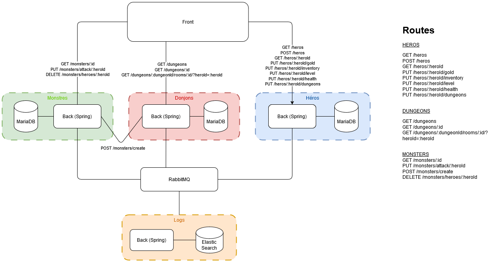
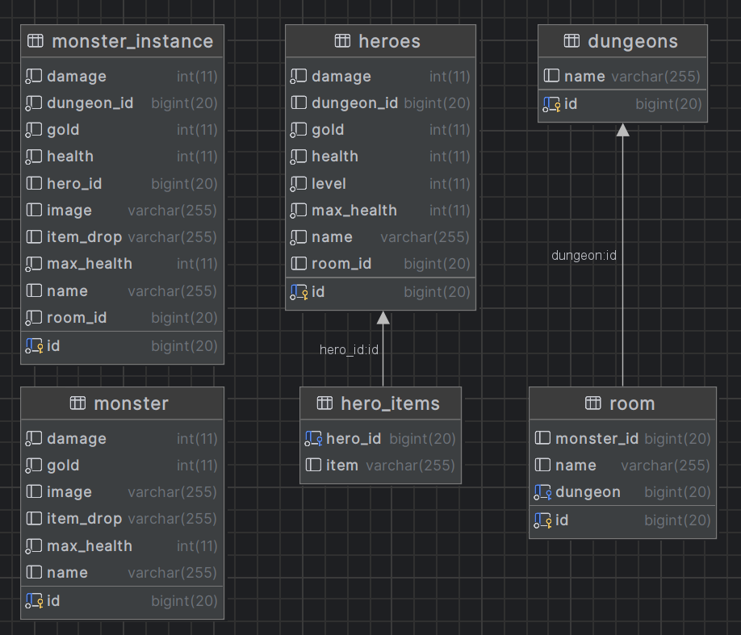

# MicroServices

## Architecture (services)



## Tables (entitées)



## API

Regarder les fichiers :
* dungeons/dungeons-api.yaml
* heroes/heroes-api.yaml
* monsters/monsters-api.yaml

## Technologies

* **Java:** 22
* **Backend**: Spring Boot
* **Frontend**: Svelte
* **Database (sauf logs)**: MariaDB
* **Database Logs**: Elasticsearch (visualisation: Kibana)
* **Messaging**: RabbitMQ

## Messaging

Tout les services (sauf `logs`) postent sur `logQueue` et le service `logs` écoute sur cette queue et poste les messages dans Elasticsearch.

## Installation

```bash
git clone https://github.com/IMT-Mines/MicroServices.git
cd MicroServices
docker-compose up
# Run in separate terminals for each service to see app logs (startup, etc. if needed)
cd dungeons && ./gradlew bootRun
cd heroes && ./gradlew bootRun
cd monsters && ./gradlew bootRun
cd logs && ./gradlew bootRun
```